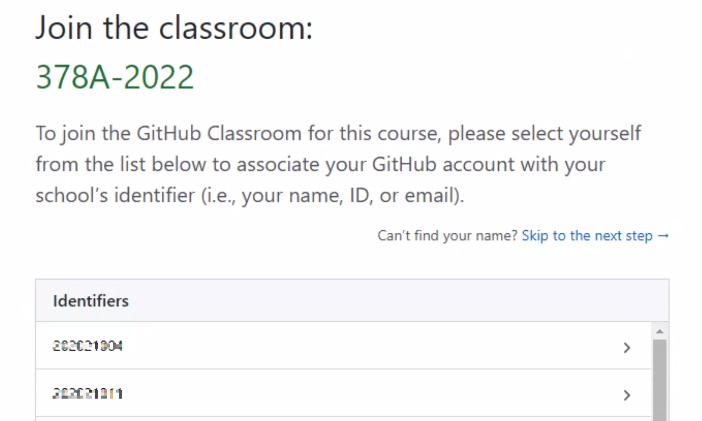
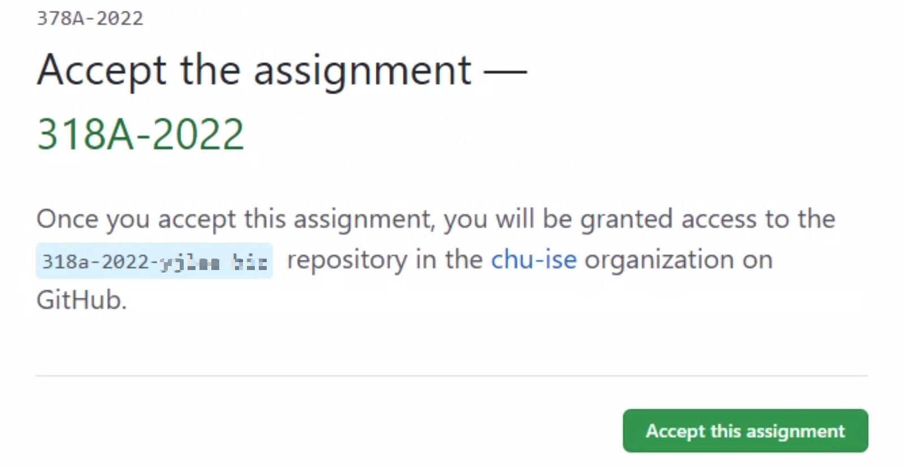
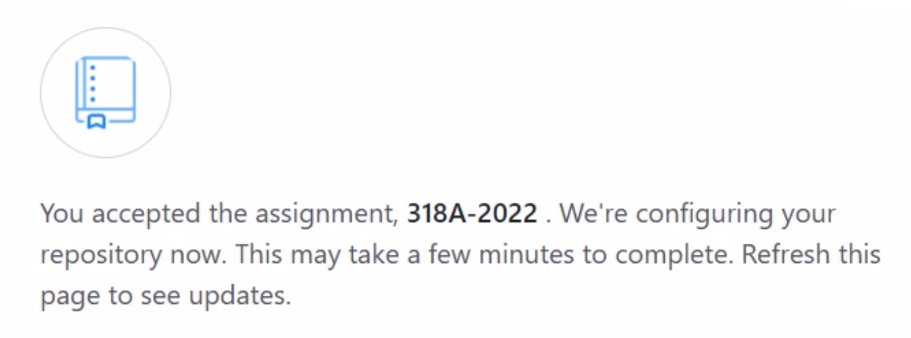
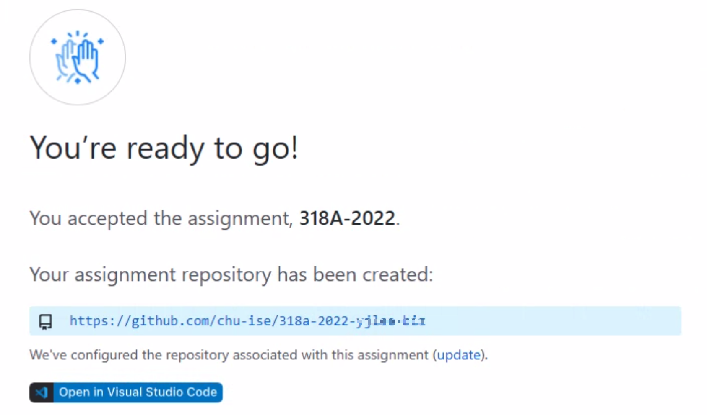
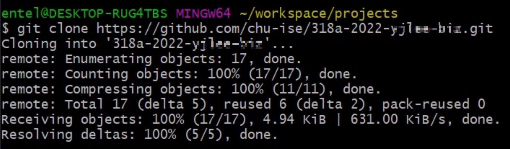
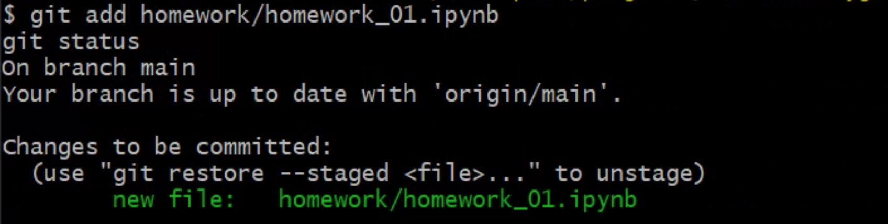
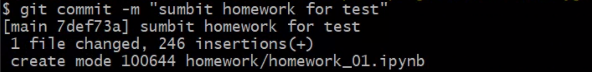
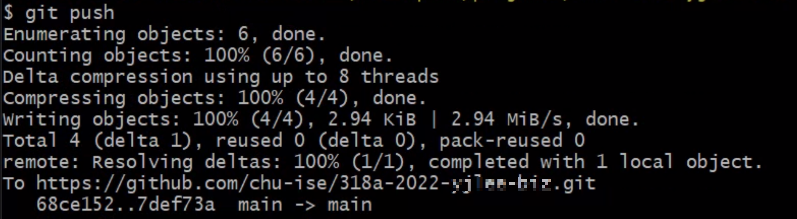
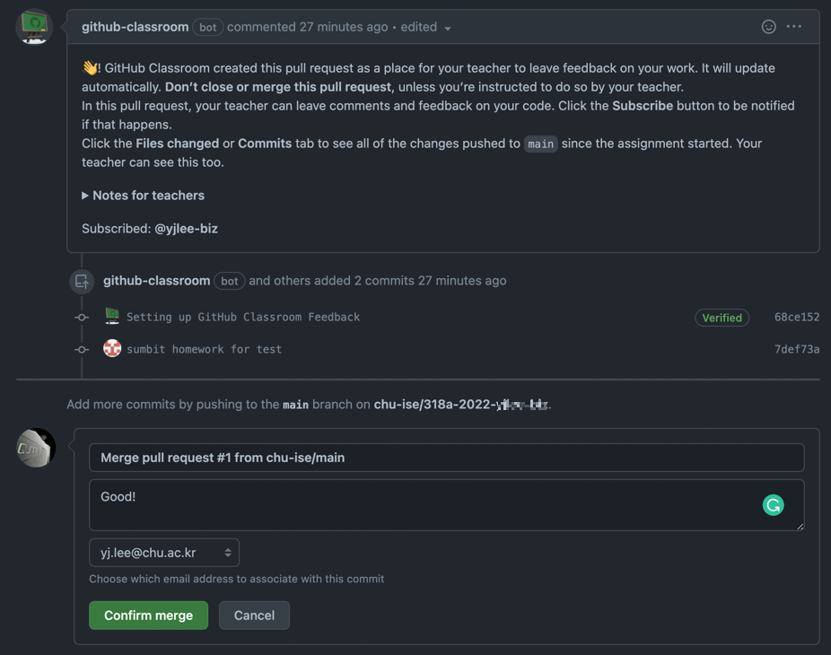
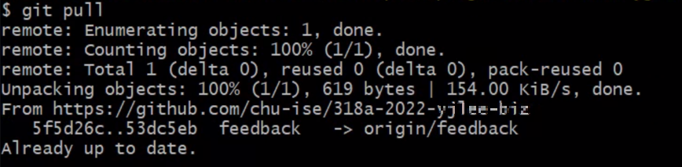

# :wave: Using GitHub Classroom

## Accept the assignment with the following invitation link.

> The invitation link: https://classroom.github.com/a/OpgHDc-r

## Join the classroom

To join the GitHub Classroom for the course, please select yourself from the list below to associate your GitHub account with your school’s ID.



## Accept the assignment



You will get your own repository for the assignment.



like the below



## Clone your assignment respository

```bash
git clone https://github.com/chu-ise/318a-2022-[your_id].git
```



## Do your work!

Copy the homeworks from [the class repository](https://github.com/chu-ise/378A-2022/tree/main/homework) to the homework folder, then do your work.

## Submit your work

### add your homework to the git repo

```sh
git add homework/homework_01.ipynb
git status
```



### commit the changes to the repo

```sh
git commit -m "your message"
```



### push to your github repo

```sh
git push
```



## Pull requests and feedback

GitHub Classroom creates a pull request as a place for your teacher to leave feedback on your work.



## Pull the feedback from the github repo

```sh
git pull
```


